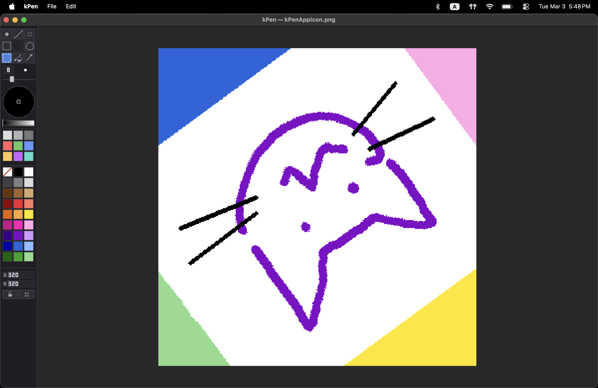
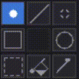
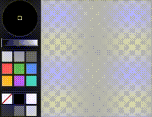
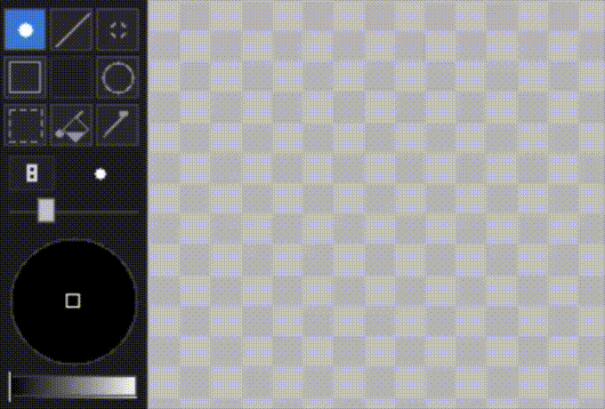
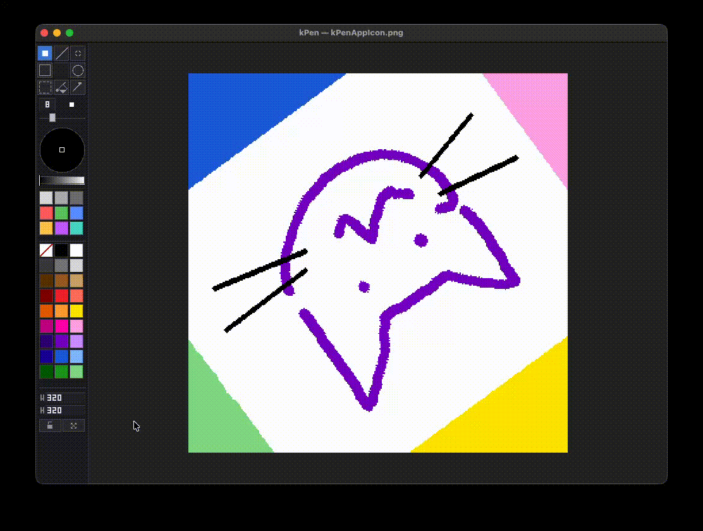

# kPen

a lightweight raster drawing app



## Installation

**macOS (Homebrew):**

```bash
brew install --cask --no-quarantine kaikino/kpen/kpen
```

**Windows** — Download and run the latest installer from [Releases](https://github.com/kaikino/kPen/releases).

**Linux (Experimental!)** — Download the latest `kPen` from [Releases](https://github.com/kaikino/kPen/releases) and run the `kPen` binary (`chmod +x kPen && ./kPen`).

**Build from source** — Requires CMake 3.10+, C++17, and SDL2.

- **macOS:** `brew install sdl2`. Output: `build/kPen.app`.
- **Linux (Debian/Ubuntu):** `sudo apt install cmake libsdl2-dev`. Output: `build/kPen`.
- **Linux (Fedora):** `sudo dnf install cmake SDL2-devel`. Output: `build/kPen`.
- **Linux (Arch):** `sudo pacman -S cmake sdl2`. Output: `build/kPen`.
- **Windows:** Install [CMake](https://cmake.org/download/) and [SDL2](https://github.com/libsdl-org/SDL/releases) (or vcpkg: `vcpkg install sdl2` and pass `-DCMAKE_TOOLCHAIN_FILE=[vcpkg]/scripts/buildsystems/vcpkg.cmake`). Output: `build/Release/kPen.exe`; put `SDL2.dll` next to it if using a prebuilt SDL2.

```bash
git clone https://github.com/kaikino/kPen.git
cd kPen
cmake -B build
cmake --build build
```

---

## Toolbar


| Section            | Description                                                                                                                                                                                                                                       |
| ------------------ | ------------------------------------------------------------------------------------------------------------------------------------------------------------------------------------------------------------------------------------------------- |
| **Tool grid**      | 3×3 grid with 8 tools (Brush, Line, Eraser, Rect, Circle, Select, Fill, Pick). Click a tool to activate; click the same tool again to toggle its option (see Keybinds).                                                                           |
| **Brush size**     | Numeric field (1–99). Click to focus and type, or use `,` / `.` keys. Scroll wheel over the field to change size.                                                                                                                                 |
| **Color wheel**    | Hue/saturation picker. Drag to set hue and saturation.                                                                                                                                                                                            |
| **Color swatches** | 9 customizable colors and 27 preset colors. Arrow keys to navigate. Drag a swatch onto another to copy the source color into a custom swatch, or onto the canvas to set the background color. Select a color while a selection is active to fill. |
| **Canvas resize**  | Width and height fields; button to lock/unlock aspect ratio (or hold Shift while resizing); button to toggle between Scale / Crop; `Enter` commits the resize.                                                                                    |


---

## Keybinds


|               | Action                           | Key                         |
| ------------- | -------------------------------- | --------------------------- |
| **Tools**     | Brush (round / square)           | `B`                         |
|               | Line                             | `L`                         |
|               | Eraser (round / square)          | `E`                         |
|               | Rect (outline / filled)          | `R`                         |
|               | Circle (outline / filled)        | `O`                         |
|               | Select (rectangle / lasso)       | `S`                         |
|               | Fill                             | `F`                         |
|               | Color pick                       | `I`                         |
|               | Brush size down / up             | `,` / `.`                   |
| **View**      | Pan hold / toggle                | `Space` / `H`               |
|               | Reset zoom and pan               | `Cmd+0`                     |
| **Selection** | Commit and deselect, or exit pan | `Escape`                    |
|               | Move selection contents          | `←` `↑` `↓` `→`             |
|               | Lock resize aspect ratio         | `Shift`                     |
|               | Lock rotation angle              | `Shift`                     |
|               | Select All                       | `Cmd+A`                     |
|               | Delete selection contents        | `Delete` / `Backspace`      |
| **File**      | New                              | `Cmd+N`                     |
|               | Open                             | `Cmd+O`                     |
|               | Save / Save As                   | `Cmd+S` / `Cmd+Shift+S`     |
| **Edit**      | Undo / Redo                      | `Cmd+Z` / `Cmd+Shift+Z`     |
|               | Cut / Copy / Paste               | `Cmd+X` / `Cmd+C` / `Cmd+V` |


---

## File and edit

- **File:** New, Open, Save, Save As, Close (see Keybinds). Save and open supports PNG and JPEG.

---

## Demos

**Tool options** — Click a tool to activate; click again to toggle its option (e.g. brush round/square, rect outline/filled, select rect/lasso).



**Color wheel and swatches** — Hue/saturation picker and custom/preset swatches; drag a preset swatch to a custom swatch to copy.



**Drawing with different tools** — Brush, shapes, selection, fill, and more.



**Canvas resize** — Button to lock/unlock aspect ratio; button to toggle between Scale / Crop.

