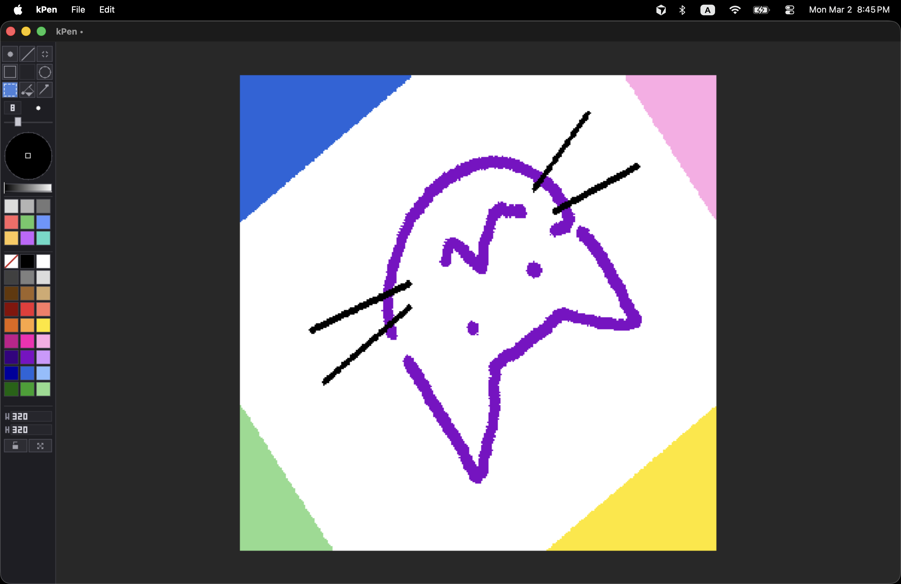

# kPen

A lightweight raster drawing app with a fixed toolbar, unlimited undo, and selection tools.

<p align="center"></p>

## Installation

**macOS (Homebrew):**

```bash
brew install --cask --no-quarantine kaikino/kpen/kpen
```

**Build from source:**

Requires CMake 3.10+, C++17, and SDL2.

```bash
git clone <repo-url>
cd kPen
cmake -B build
cmake --build build
```

On macOS the app is built as `build/kPen.app`. On Windows/Linux the executable is in `build/`.

---

## Toolbar


| Section            | Description                                                                                                                                                                                       |
| ------------------ | ------------------------------------------------------------------------------------------------------------------------------------------------------------------------------------------------- |
| **Tool grid**      | 3×3 grid with 8 tools (Brush, Line, Eraser, Rect, Circle, Select, Fill, Pick). Click a tool to activate; click the same tool again to toggle its option (see Keybinds).                           |
| **Brush size**     | Numeric field (1–99). Click to focus and type, or use `,` / `.` keys. Scroll wheel over the field to change size.                                                                                 |
| **Color wheel**    | Hue/saturation picker. Drag to set hue and saturation.                                                                                                                                            |
| **Color swatches** | 9 customizable colors and 27 preset colors. Arrow keys to navigate. Drag a swatch onto another to copy the source color into a custom swatch. Select a color while a selection is active to fill. |
| **Canvas resize**  | Width and height fields, optional “Scale content” checkbox, and “Lock aspect” (or hold Shift while resizing). Enter commits the resize.                                                           |


---

## Keybinds


|               | Action                           | Key                         |
| ------------- | -------------------------------- | --------------------------- |
| **Tools**     | Brush (round / square)           | `B`                         |
|               | Line                             | `L`                         |
|               | Eraser (round / square)          | `E`                         |
|               | Rect (outline / filled)          | `R`                         |
|               | Circle (outline / filled)        | `O`                         |
|               | Select (rectangle / lasso)       | `S`                         |
|               | Fill                             | `F`                         |
|               | Color pick                       | `I`                         |
|               | Brush size down / up             | `,` / `.`                   |
| **View**      | Pan hold / toggle                | `Space` / `H`               |
|               | Reset zoom and pan               | `Cmd+0`                     |
| **Selection** | Commit and deselect, or exit pan | `Escape`                    |
|               | Move selection contents          | `←` `↑` `↓` `→`             |
|               | Select All                       | `Cmd+A`                     |
|               | Delete selection contents        | `Delete` / `Backspace`      |
| **File**      | New                              | `Cmd+N`                     |
|               | Open                             | `Cmd+O`                     |
|               | Save / Save As                   | `Cmd+S` / `Cmd+Shift+S`     |
| **Edit**      | Undo / Redo                      | `Cmd+Z` / `Cmd+Shift+Z`     |
|               | Cut / Copy / Paste               | `Cmd+X` / `Cmd+C` / `Cmd+V` |


---

## File and edit

- **File:** New, Open, Save, Save As, Close (see Keybinds). Save supports PNG and JPEG; Open supports PNG, JPEG, BMP, GIF. Window title shows an unsaved indicator when the canvas has changed since last save.

